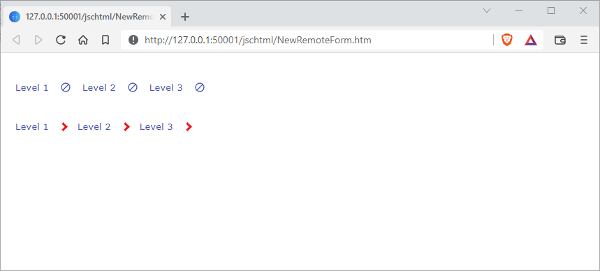

# Breadcrumbs

Simple Breadcrumbs for Omnis JSC 10.2, with support for Themes and SVG Themed Icons



## Example data source

```
Do iListCrumbs.$define()
Do iListCrumbs.$cols.$add("label",kCharacter,kSimplechar)
Do iListCrumbs.$add("Level 1")
Do iListCrumbs.$add("Level 2")
Do iListCrumbs.$add("Level 3")
```

## Set up

1. Copy the content of `controls/com.888sp.tabstrip` into Omnis `html/controls` folder
2. Copy `dist/ctl_com_888sp_tabstrip.bundle.js` into Omnis `html/script` folder
3. In `jsctemp.htm`, load `ctl_com_888sp_breadcrumbs.bundle.js`